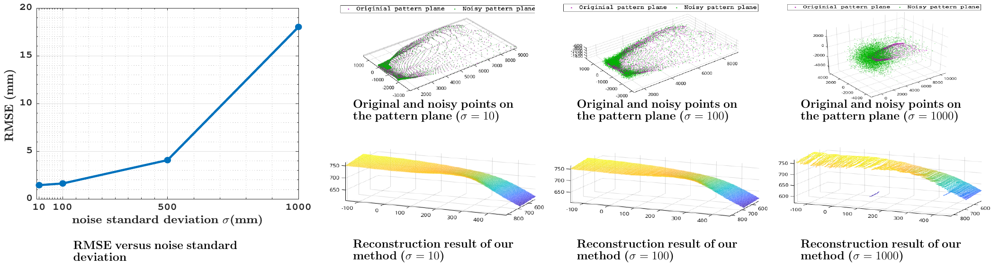
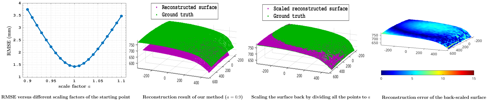

# POSSR
# Patch-Based Optimization for Noise-Robust Reconstruction of Specular Surfaces

This repository provides the implementation and data for the paper:

> **Patch-Based Optimization for Noise-Robust Reconstruction of Specular Surfaces**  
> *Saed Moradi, M. Hadi Sepanj, Amir Nazemi, Claire Preston, Anthony M. D. Lee, and Paul Fieguth*  
>  2025  
> [📄 PDF]() | [📊Sample Data](https://github.com/moradisaed/POSSR/blob/main/reconstruction/surface1.mat)

---

## 🔍 Overview

Reconstructing specular (mirror-like) surfaces from a single camera view is a highly challenging problem in computer vision. This work proposes a **patch-based optimization framework** that leverages geometric and optical constraints to produce a dense and robust depth map, even under significant noise in point correspondences.

---

## 🔧 Methodology

We formulate the inverse problem of specular surface reconstruction as a local optimization problem that aligns:

- Normals estimated from reflection geometry
- Normals obtained via local plane fitting

The reconstruction proceeds **patch-wise** to maintain computational feasibility and robustness.


*Figure 1: Surface geometry and reflection overview.*
---

## 📊 Results

We conducted extensive experiments using synthetically generated data. The proposed method is:

- **Robust to noise** in both 2D and 3D reflection point correspondences
- Effective with **a single camera and a single pattern plane**
- Competitive with existing multi-plane methods under ideal conditions

### Qualitative Comparison


**Figure 2: Qualitative comparison of surface reconstruction results for noise-free (ideal) reflection correspondences.**


### Quantitative Evaluation


**Figure 3: Sensitivity of the reconstructed surface to the noise added to the points on the image plane.**


**Figure 4: Sensitivity of the reconstructed surface to the noise added to the points on the pattern plane.**



**Figure 5: Surface reconstruction results of our method in extremely noisy scenarios.**



**Figure 6: Sensitivity of the reconstructed surface to an erroneous starting point.**


---

## 📂 Repository Structure

```bash
├── dataGeneration/                 # A pipeline to generate reflection point correspondences
├── reconstruction/                 # Main MATLAB source code for reconstruction
├── README.md                       # This file
```

---

## 📌 Citation

If you find this repository useful in your research, please cite:

```bibtex
@article{moradi2025poss,
  title     = {Patch-Based Optimization for Noise-Robust Reconstruction of Specular Surfaces},
  author    = {Moradi, Saed and Sepanj, M. Hadi and Nazemi, Amir and Preston, Claire and Lee, Anthony M. D. and Fieguth, Paul},
  journal   = {},
  year      = {2025}
}
```

---

## 📬 Contact

For questions, please contact [Saed Moradi](mailto:saed.moradi@uwaterloo.ca).
